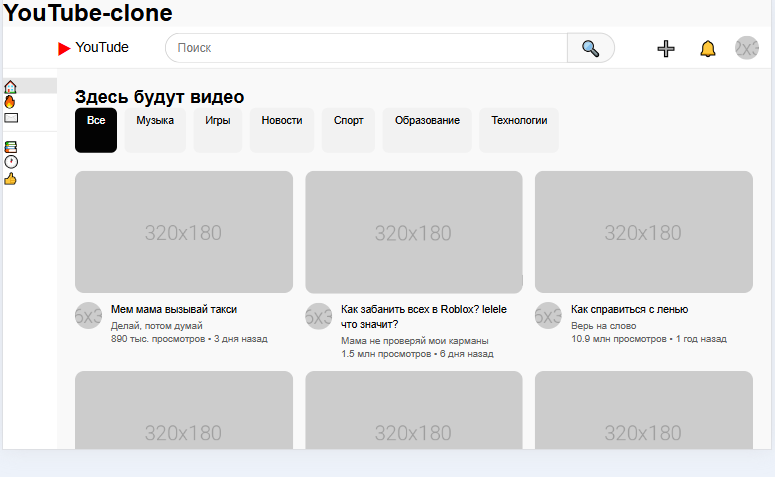
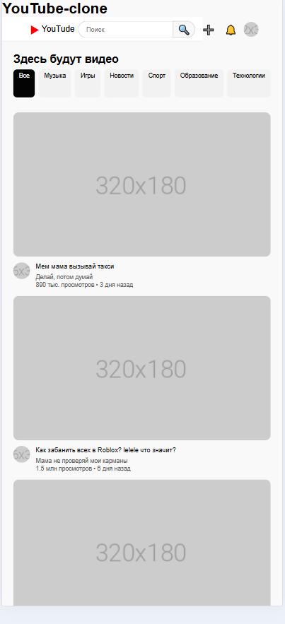

# YouTube Clone - Лабораторная работа №11
**Студент:**
[Чайкалак Данара Рустамовна] 
**Группа:**
[ИСП - 231]

---
## Описание
Адаптивный клон главной 
страницы YouTube, созданный с использованием HTML, CSS, Flexbox и CSS Grid.

---
## Реализованные функции
- [ ] Адаптивный хедер с поиском
- [ ] Боковая панель навигации
- [ ] Категории (чипсы) с интерактивностью
- [ ] Сетка видео с карточками
- [ ] Hover-эффекты на карточках
- [ ] Полная адаптивность под все устройства
- [ ] Добавьте свои функции
---
## Технологии
- HTML5
- CSS3
- Flexbox
- CSS Grid
- Media Queries
---
## Скриншоты
### Desktop (1920px)

### Tablet (1024px)

### Mobile (375px)

## Как запустить
1.Откройте файл `index.html`в браузере
2.Или используйте **Live Server**
- Установите расширение Live Server
- Правой кнопкой по `в VS Code: index.html` → Open with Live Server
---
## Структура проекта
## Вывод
В ходе выполнения лабораторной работы я изучил основы адаптивной вёрстки, освоил работу с Flexbox и CSS Grid, научился создавать интерактивные элементы с помощью CSS. 
Проект помог мне лучше понять принципы создания современных веб-интерфейсов."
### Дата выполнения
20.02.2026